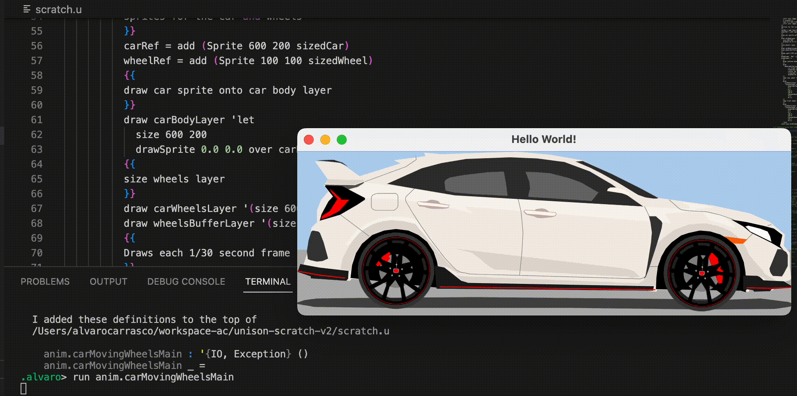
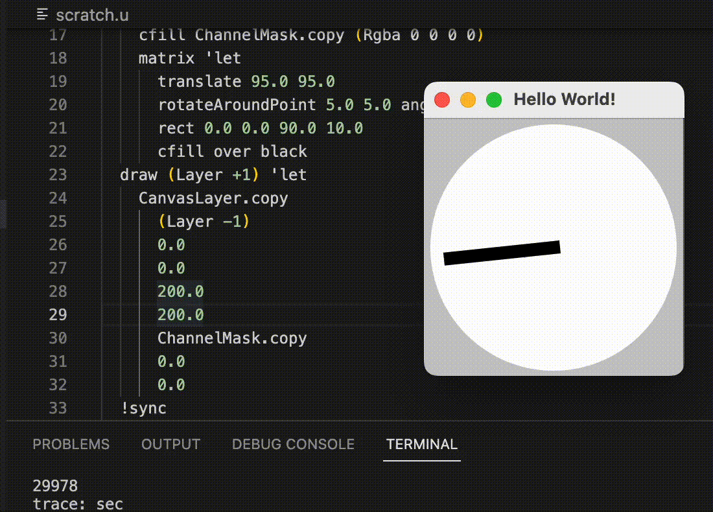

Electron app that listens for guacamole drawing commands on port 9002 and renders them on an HTML canvas.
Should be suitable as a remote canvas or animation surface for a command-line app.

```
$ yarn run main
```

Examples:

 


